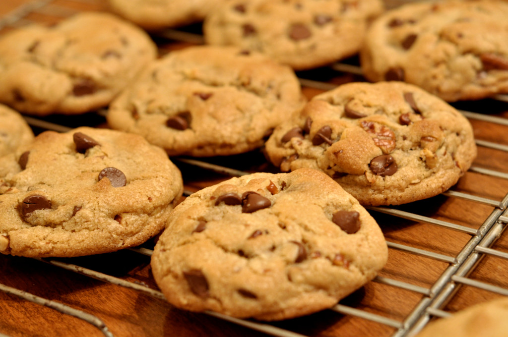

= Cookie Clicker

// Links
:clicker: https://en.wikipedia.org/wiki/Cookie_Clicker

Type of challenge: *consolidation* +
Duration: *2 days* +
Team challenge: *4*

== Missions objectives

At the end of this challenge you should have improved your:

* *JavaScript* skills
* team skills
* git conflict skills

== The mission

This challenge will have you create a {clicker}[cookie clicker] as a team.
Follow the instructions to complete the challenge, to get some ideas check the
examples in the _resources_ section.

=== Instructions

NOTE: The steps below are meant to help you in development, but as long as you
make a cookie clicker you can implement whatever you want.

.Step 1: base structure
Write the base structure for the project in *HTML*, *CSS* and *JavaScript*.
Within the HTML, put a _click_ button which will increment a counter and a label
initialised at _0_ to display said counter.

.Step 2: prepare the JavaScript
In your JavaScript prepare variables to allow you to control your button and
label. You will also need a variable to keep track of the score.

.Step 3: increase the score
When you click the button, increase the variable storing the score by _1_, then
display the current score inside the label.

.Step 4: make a multiplier
Add another button which will act as a multiplier. When called this button will
permanently multiply the number of points per click, by _two_ for example.

.Step 5: price of multiplier
The multiplier allows you to have a big score quickly, that shouldn't be free,
it should be a purchase made with the current player score.

.Step 6: no credit
You can't make credit, meaning that the player cannot have a negative score.
Think about updating the score display after a purchase.

.Step 7: display multiplier counter
Display the counter within the multiplier. For example, if the counter is worth
_5_, then the button should display something like _multiplier x5_.

.Step 8: increase the cost
Buying a lot of multiplier is way too easy. For more fun, make it so that each
time a multiplier is purchased the cost of buying a new one is increased.

.Step 9: display the cost
In the text of the multiplier button you should also have the price of the
upgrade.

.Step 10: auto-clicker
Implement a new improvement to buy, the _auto-click_. As the name might suggest
this bonus will automatically add a click to your score each _x_ seconds.

.Step 11: bonus
Implement yet another improvement to buy, the _bonus_. It should grant the
player a boost in score of _200%_ per click for _30 seconds_. When purchased the
player should see a timer with the remaining time inside the bonus button.

.Step 12: deactivate the buttons 
Make it so that, if the player doesn't have the points to purchase a multiplier,
an auto-click or an other bonus, he can't.

.Step 13: make it pretty
Your cookie clicker must be pretty, make it look good with CSS or some extra
JavaScript.

=== Resources

* http://orteil.dashnet.org/cookieclicker/[cookie clicker]
* https://particle-clicker.web.cern.ch/particle-clicker/[particle clicker]

== Congrats

After all this hard work together, you all deserve a cookie.

image::https://media.giphy.com/media/l3nWl5bhBoim7glNu/giphy.gif[]
